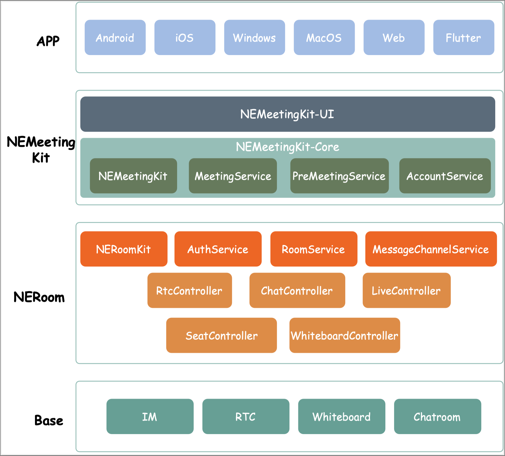
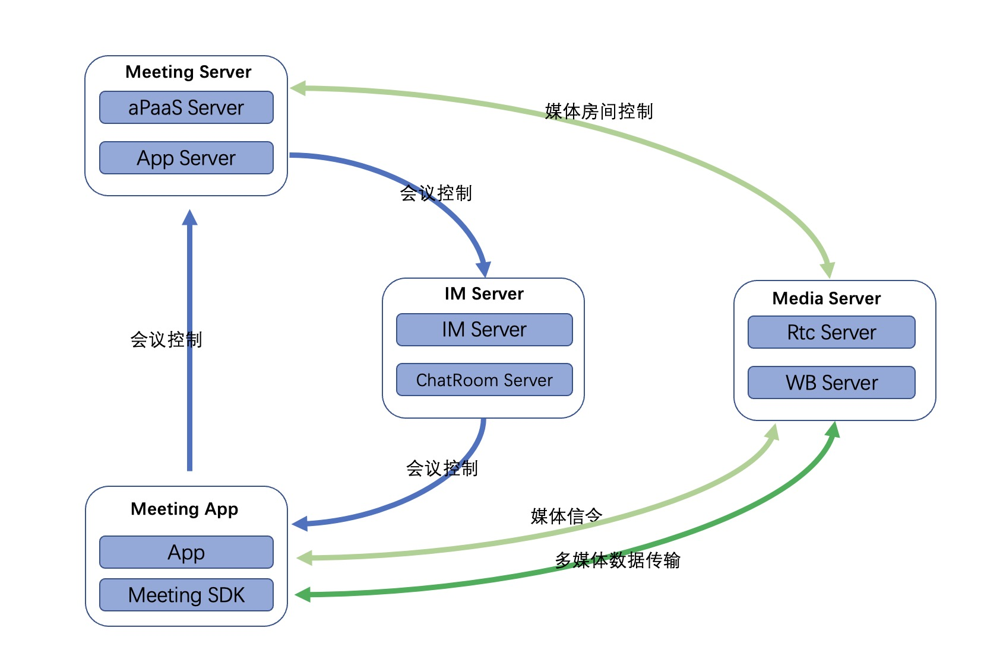
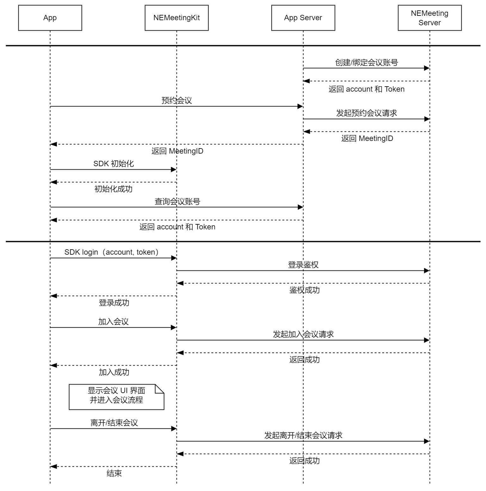

# 网易会议概述
网易会议客户端目前已经开源，源代码已经上传至 Github。该项目由网易云信团队自研，结合网易云信系统相关通讯功能，实时音视频、即时消息、白板、直播等功能构建一套会议系统，可以让开发者很容易具备高效稳定会议系统能力, 一周就能开发出一个属于自己的ZOOM。

> 更多信息请查看[网易视频会议解决方案](https://doc.yunxin.163.com/meeting/concept/TM0MjIwODk?platform=client)，或通过[网易会议官网](https://meeting.163.com/)下载体验。

## 功能特性

<table>
 <tr>
 	<td width="100px">功能分类</td>
	<td width="100px" >功能</td>
	<td>功能描述</td>
 </tr>
  <tr>
 	<td>基础功能</td>
	<td>语音/视频通话</td>
	<td>支持一对一或多人间的语音/视频通话功能，并进行音视频实时切换。支持纯转发会议或者讨论式会议。</td>
  </tr>
  <tr>
    <td rowspan="3">协作功能</td>
	<td>实时消息</td>
	<td>主持人和与会人在会议过程中发送实时文字、图片、文件消息进行互动。</td>
 </tr>
   <tr>
	<td>白板共享</td>
	<td>主持人在白板上书写，有助于提升协作效率；其他与会人也可使用白板与主持人进行实时互动。支持白板双指缩放大小及移动位置。</td>
 </tr>
   <tr>
	<td>屏幕共享</td>
	<td>主持人或与会人将自己屏幕的内容分享给其他与会人观看，提高沟通效率。</td>
 </tr>
  <tr>
    <td rowspan="3">管理功能</td>
	<td>会议控制</td>
	<td>可区分主持人、联席主持人和与会人员角色权限，显示与会人员列表及音视频状态。主持人和联席主持人可以管理与会人在会议过程中发送音、视频的权限，例如全体静音、单独关闭某与会人员的摄像头或麦克风、移出房间、设置与会人员开启摄像头或麦克风需审批(举手)等。提供进出会议人员通知，可以设置房间超过预定人数后关闭通知。</td>
 </tr>
   <tr>
	<td>会议邀请</td>
	<td>一键获取会议名称、密码，邀请他人参与会议。</td>
 </tr>
   <tr>
	<td>视图切换</td>
	<td>可以设置演讲者视图或平铺视图。支持自动切换视频视图和音频视图。</td>
 </tr>
</table>

# 网易会议架构
整套会议系统客户端支持 Android、iOS、Web、H5、Electron、Windows、macOS等平台, 如何确保用户快速接入以及各端一致性问题, 我们对会议客户端进行了一定的拆分设计。

## 网易会议架构：

### Base

云信基础能力 SDK 层。包含即时通信（IM）、实时音视频（RTC）、互动白板、聊天室等。

### [NERoom](https://doc.yunxin.163.com/neroom/concept?platform=client)

NERoom 是一个无 UI 的房间服务组件，不包含业务逻辑，只提供房间基础能力封装。通过配置房间的模板，可以定义房间内的角色、资源、成员的权限等，快速开发出房间维度的上层业务组件。如果开发者不复用NEMeetingKit的默认UI实现，可以基于NERoom自己搭建上层应用。

### [MeetingKit](https://doc.yunxin.163.com/meeting/guide?platform=android)

Meeting SDK 是一个带UI的会议服务组件, 相比于NERoom 我们提供了一整套的标准会议UI实现, 同时我们也提供了有限的UI自定义功能。

移动端基于 Flutter 实现, 为了方便原生项目接入, 同样我们提供混合开发模式允许通过Java以及OC等原生语言接入。

桌面端基于 Electron 实现, 为了便于客户集成, 我们通过IPC等机制把Electron相关实现进行了隔离, 避免用户工程集成问题。

### App

云信标准版网易会议应用实现, 支持直接编译成一个独立的应用。

# 网易会议系统服务交互流程：

会议系统设计利用云信原有PaaS能力, 我们通过 IM Server 来进行会控通知和聊天, 通过Media Server实现 媒体数据的转发。

在此基础上我们重点对会议相关特性进行了设计, 包括多租户账号体系、安全入会、会议预定、会议控制、视图布局、角色控制等。

--------------------

为便于开发者对网易会议系统的理解，我们提供了网易会议相关的时序图供开发者进行流程上的参考；  

--------------------

# 集成方法概述
为了方便客户的集成，我们在开源代码的基础上，提供了基于组件的集成方式。
1. [Android 组件集成](https://doc.yunxin.163.com/meeting/guide?platform=android)
2. [iOS 组件集成](https://doc.yunxin.163.com/meeting/guide?platform=iOS)
3. [Windows/Mac 组件集成](https://doc.yunxin.163.com/meeting/guide?platform=pc)
4. [Web/H5 组件集成](https://doc.yunxin.163.com/meeting/guide?platform=web)
5. [Electron 组件集成](https://doc.yunxin.163.com/meeting/guide?platform=electron)

# 代码许可
The MIT License（MIT）

# 交流 & 反馈
扫码入群
[开源交流群](https://github.com/GrowthEase/NetEase_Meeting/blob/main/images/%E7%A4%BE%E7%BE%A4%E4%BA%8C%E7%BB%B4%E7%A0%81.jpg)

