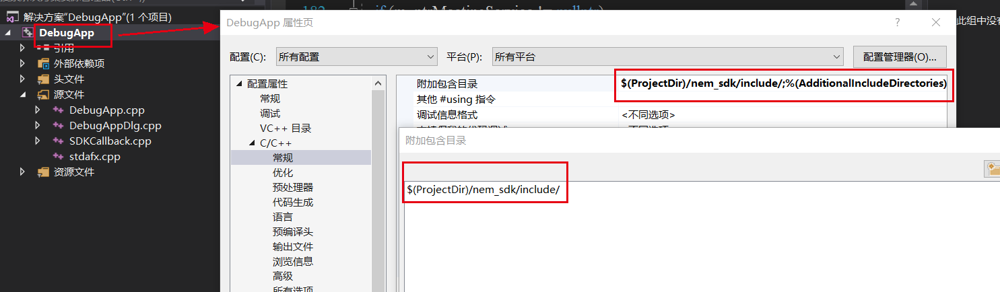

# 网易会议 PC端组件化SDK
## 简介
略
## 目录结构
略

## 接入VC++
引入SDK接口文件到工程  

## 主要类介绍
 - `IGlobal SDK全局对象`，提供SDK的初始化、反初始化、获取其它功能对象的功能
 - `INEMAuthService` 认证模块，提供登录、登出等操作
 - `INEMSettingService` 会议模块，提供会议创建、加入、结束、离开等功能
## 初始化
因为`SDK所有功能接口的调用都是异步的`应用层需要向相应模块注册回调对象,通过 `static IGlobal* IGlobal::GetGlobal()` 获取到SDK全局实例,调用`IGlobal::SetGlobalCallback`向Global对象注册回调对象,
，调用`IGlobal::Init`来进行SDK的初使化，SDK初始化完成后会调用应用层设置的回调对象以通知初始化结果
## 通过Global对象获取其它功能对象
在初始化成功以后可以通过`IGlobal::GetXXXXXService`来获取相应功能模块实例,如果初始化失败，或者未完成初始化此接口无法返回相应实例        
## 登录
通过`IGlobal::GetMeetingService`接口获取认证模块实例，并向该模块注册认证回调对象(`INEMAuthService::SetAuthCallback`)
## 会议功能
通过`IGlobal::GetAuthService`接口获取认证模块实例，并向该模块注册认证回调对象(`INEMAuthService::SetMeetingCallback`)
## 接口中无需关注的类
- `IGlobalProcHandler`SDK全局处理模块接口定义，应用层无需要关心
- `INEMAuthServiceProcHandler`SDK认证处理模块接口定义，应用层无需要关心
- `IMeetingServiceProcHandler`SDK会议处理模块接口定义，应用层无需要关心
## 参考代码实现
        class GlobalCallback : public IGlobalCallback
        {
        public:
            GlobalCallback(const std::function<void(bool)>& funOnInitCB) :
            m_funOnInitCB(funOnInitCB)
            {

            }
        public:
            virtual void OnInit(const NEMError& result) override
            {
                if(m_funOnInitCB != nullptr)
                    m_funOnInitCB(result.ErrorCode() == NEMErrorCode::kSuccess);
            }
            virtual void OnUnInit(const NEMError& result) override
            {

            }
        private:
            std::function<void(bool)> m_funOnInitCB;
        };

        .......

        IGlobal* g_ptrNMESDKGlobal;
	    GlobalCallback* g_ptrGlobalCallback;
        AuthCallback* g_ptrAuthCallback;
        MeetingCallback* g_ptrMeetingCallback;
        INEMAuthService* g_ptrAuthService;
        INEMMeetingService* g_ptrMeetingService;

        void foo()
        {
            g_ptrNMESDKGlobal = IGlobal::GetGlobal();
	        if (g_ptrNMESDKGlobal != nullptr)
            {
		        g_ptrGlobalCallback = new GlobalCallback([this](bool ret) {
                    if (ret)
                    {
                        g_ptrAuthService = g_ptrNMESDKGlobal->GetAuthService();
                        if (g_ptrAuthService != nullptr)
                        {
                            g_ptrAuthCallback = new AuthCallback();
                            g_ptrAuthService->SetAuthCallback(g_ptrAuthCallback);
                        }		

                        g_ptrMeetingService = g_ptrNMESDKGlobal->GetMeetingService();
                        if (g_ptrMeetingService != nullptr)
                        {
                            g_ptrMeetingCallback = new MeetingCallback();
                            g_ptrMeetingService->SetMeetingCallback(g_ptrMeetingCallback);
                        }				
                    }
                });
		        g_ptrNMESDKGlobal->SetGlobalCallback(m_ptrGlobalCallback);		
	        }
        }
